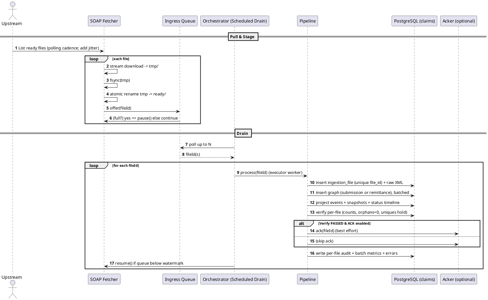

# Claims App — **Complete Ingestion Flow (SOAP → DB)**
Updated: 2025-09-07 02:53 UTC+05:30

> **Scope**: End‑to‑end behavior from **SOAP fetch** to **optional ACK**, including backpressure, parsing/validation, persistence, event projection, verification gating, audit/metrics, scaling, failure posture, and operational runbook.  
> **Roots supported**: **Claim.Submission** and **Remittance.Advice** (StAX streaming).  
> **Profiles**: `ingestion` (worker), `soap` | `localfs` (choose exactly one fetcher/acker), `api` (read-only server), `adminjobs` (nightly ops).

---

## 0) TL;DR
**Fetcher (SOAP)** → *stage to temp* → *fsync* → *atomic rename to* `ready/` → **Queue (bounded)** → **Orchestrator (scheduled drain)** → **Parse (StAX)** → **Validate** → **Map** → **Persist** (batched, idempotent by DB uniques) → **Events/Timeline** → **Verify** (counts, orphans, uniques) → **(optional) ACK** → **Audit & Metrics**.

---

## 1) Runtime Topology & Profiles
- **Single codebase, two processes** in typical deployments:
  - **Ingestion Worker** (`ingestion` + one of `soap` or `localfs`): runs fetcher, orchestrator, pipeline, verify, audit, and (optional) ACK.
  - **API Server** (`api`): JWT/RBAC‑guarded read-only endpoints (no fetch/scheduler/ack).
  - **Admin Jobs** (`adminjobs`) optional: nightly verification & CSV exports.
- **Only one fetcher/acker active** at a time by profiles: `localfs` → `NoopAcker`; `soap` → `SoapAcker`.
- **Least privilege**: RW DB creds for ingestion; RO for API/adminjobs. No runtime uses DDL/admin roles.

---

## 2) SOAP Fetcher — What Exactly Happens
1. **List “ready” files** at the upstream (DHPO) endpoint. *(Configurable polling cadence; see TODO)*
2. For each file:
   - **Stream download to a temp path**, not directly into `ready/`.  
   - `fsync` the temp file to ensure durability.
   - **Atomic rename** temp → `ready/` (visibility boundary: downstream only sees fully written files).
   - Emit `fileId` (remote ID or filename) to the **bounded ingress queue**.
3. **Backpressure‑aware**: if queue is full, fetcher **pauses** pulling; it **resumes** when the orchestrator drains items.

**Robustness choices**:
- **Streaming I/O** avoids large heap usage.  
- **fsync + atomic rename** eliminates half‑written/partial files from being processed.  
- **Pause/Resume** integrates fetch cadence with downstream capacity (DB, CPU).

> **TODO (later)**: Set SOAP list cadence to **every 30 minutes** with jitter (e.g., `*/30` ± up to 2 minutes) to avoid thundering herd.

---

## 3) Bounded Ingress Queue (Pressure Valve)
- Small **BlockingQueue** (e.g., 16) that caps memory and smooths bursts.
- `offer(fileId)` returns **false** → fetcher immediately **pauses** (no more pulls).
- After processing, orchestrator **resume()**s fetcher when capacity is available.
- **Metrics**: queue depth, pause/resume counts, time‑in‑queue.

**Tuning knobs**:
- Queue capacity, parser worker count, DB batch size, per‑file vs per‑chunk transactions.

---

## 4) Orchestrator Drain (Steady Trickle)
- Lightweight `@Scheduled(fixedDelayString)` drain with **initialDelay=0**.
- Each tick: **poll** a handful of fileIds from the queue and submit one ingestion task per file to the **parser executor**.
- After each file completes (success/fail), **resume** the fetcher if it was paused.

---

## 5) Pipeline for a Single File
### 5.1 Parse (StAX) → DTOs
- StAX streaming parser reads **Header** first:
  - `SenderID, ReceiverID, TransactionDate, RecordCount, DispositionFlag`.
  - Normalize **TransactionDate** to UTC (maintain original offset if needed for audit).
- **Only two roots** supported:
  - **Submission**: Claim → Encounter → Diagnosis; Activity → Observation; Resubmission?; Contract?  
  - **Remittance**: Claim (ID, IDPayer, …, DateSettlement?); optional Encounter/Facility; Activity with PaymentAmount/DenialCode.
- **RecordCount enforcement**: count parsed `Claim` elements and match header’s RecordCount; mismatch = file‑level validation error.

### 5.2 Validate
- **XSD‑required fields** enforced (header + required claim, activity, etc.).
- **Business checks** (examples):
  - Money fields scale to 2; reject negatives unless spec allows.
  - DateTime parsing strict; reject impossible values.
  - Oversized strings trimmed; log truncation.
- **Error isolation**: invalid objects are logged and skipped; **good claims continue** (one bad claim doesn’t sink the file).

### 5.3 Map → Entities
- DTOs → JPA/JDBC entities via mappers.
- Sensitive fields (e.g., Emirates ID) optionally **hashed/masked** by toggle before persist.

### 5.4 Persist (Insert‑Only, Batched, Idempotent)
- Insert **ingestion_file** with header + **raw XML bytes** (SSOT), keyed by **unique `file_id`**.
- Insert the rest of the graph depending on root:
  - **Submission**: submission, claim, encounter, diagnosis, activity, observation, resubmission (and optional claim_attachment/contract).
  - **Remittance**: remittance, remittance_claim, remittance_activity.
- **Idempotency by DB uniques** (exactly‑once effect):
  - `ingestion_file.file_id`
  - `(claim_id, activity_id)` (per claim)
  - **Observation de‑dup index** `(activity_id, obs_type, obs_code, md5(value_text))`
  - `(remittance_id, claim_key_id)` and `(remittance_claim_id, activity_id)`
  - **Event uniqueness**: one SUBMISSION per claim; `(claim_key_id, type, event_time)` unique
- **Conflict policy**: duplicates are **ignored** (safe replay).
- **Transactions**:
  - Default: *per‑file* transaction.
  - For very large files: switch to *per‑chunk* commits targeting **<5s** per commit to reduce lock pressure.
- **Batch size**: start around **1000** rows; adjust based on DB p95 latency.

### 5.5 Events & Claim Status Timeline
- **Events**: `SUBMISSION (1)`, `RESUBMISSION (2)`, `REMITTANCE (3)` per claim key.
  - `event_time = Header.TransactionDate`; provenance: FK to `ingestion_file`.
  - **Snapshots**: activities → `claim_event_activity`; observations → `event_observation`.
- **Status timeline** (derived rules):
  - **PAID**: sum(payment) == claim.net
  - **PARTIALLY_PAID**: 0 < sum(payment) < claim.net
  - **REJECTED**: denial & sum(payment) == 0
  - **SUBMITTED/RESUBMITTED/UNKNOWN** otherwise
  - Last timeline row = current status.

### 5.6 Verify (Gates ACK)
- Post‑file **verification** runs immediately after persist:
  - **Counts** match expected (claims, activities, etc.).
  - **Orphans** = 0 across chains.
  - **Uniques** hold (no dupes slipped through).
- Result: **PASS/FAIL** stored in audit; used to gate ACK.

### 5.7 ACK (Optional, Toggle‑Controlled)
- If `ack.enabled=true` **and** verify passed:
  - Perform **best‑effort** ACK upstream with the original `fileId`.
  - ACK failures are logged; **no data rollback**.
- Default: **ACK OFF** (enable after a burn‑in period with green verifies).

---

## 6) Audit & Observability
- **Per‑file audit**: header echo, parsed vs persisted counts, verify status, ACK attempted/sent, error summaries.
- **Batch metrics** per stage (PARSE, VALIDATE, MAP, INSERT_*, PROJECT_EVENTS, VERIFY, ACK): rows attempted/inserted, conflicts ignored, retries, timing.
- **Error log** (fine‑grained): stage, object key (e.g., Claim.ID), message, retryable flag, stack excerpt.
- **KPI view / exports** (nightly via cron or `adminjobs`): files ok/fail/already, parsed/persisted counts, duplicates, orphans, last‑24h errors, events coverage.

**SLIs**: file success rate, verify pass rate, queue depth p95, claims/sec/worker, DB p95 insert latency, conflict rate, ACK success rate.  
**Alerts**: verify failures >0 recent, queue >80% for >X mins, ACK errors >Y%, DB p95 > target for Z mins.

---

## 7) Scaling Strategy (Tuning Order)
1) If queue often **empty**: increase **fetcher concurrency** (SOAP) and/or **poll cadence**.  
2) Increase **parser workers** (≤ CPU cores).  
3) Adjust **batch size** (smaller if DB latency/locks rise).  
4) Switch to **per‑chunk transactions** (<5s).  
5) Consider **horizontal split**: additional ingestion worker only if upstream can partition workload.

**DB**: indexes healthy, autovacuum/analyze tuned, WAL/IO provisioned, connection pool steady-state sized.

---

## 8) Failure Posture
- **Validation failures**: claim/file logged as FAIL; good claims continue; **no ACK**.  
- **Transient DB/network**: retried; idempotency guarantees safe replays; failed ACKs don’t rollback.  
- **Queue saturation**: fetcher pauses; resumes when capacity returns.  
- **Corrupt/partial downloads**: prevented by atomic rename; corrupt content detected at parse → logged/skipped.  
- **Disk full**: fetcher pauses on I/O errors; alert; no premature ACK.

---

## 9) Security & Secrets
- **RW vs RO** DB users (least privilege).  
- Secrets via **App‑Managed Encryption** or secret manager.  
- **Hash/mask** toggle for sensitive claim fields.  
- **JWT/RBAC** on API & admin endpoints; admin actions audited.

---

## 10) Improvements (Proposed)
1. SOAP cadence **every 30 min** with jitter.  
2. File **checksum** (remote ETag/SHA-256 vs local) stored in audit.  
3. Optional **content-hash file_id** (dedupe same content with different names).  
4. **Attachment policy** (size caps; optional object storage).  
5. **Stage‑to‑disk janitor** for orphaned tmp files.  
6. Health endpoints include **backlog depth** and **last verify**.  
7. **Circuit breaker + backoff** for SOAP list/download/ack.  
8. **Ops endpoints**: pause/resume/drain-now/requeue.  
9. **DR**: WORM archive of all pulled XML; replay safe via idempotency.  
10. **Partitioning/Archival** per ADR thresholds.

---

## 11) PlantUML Sequence (paste into your renderer)

